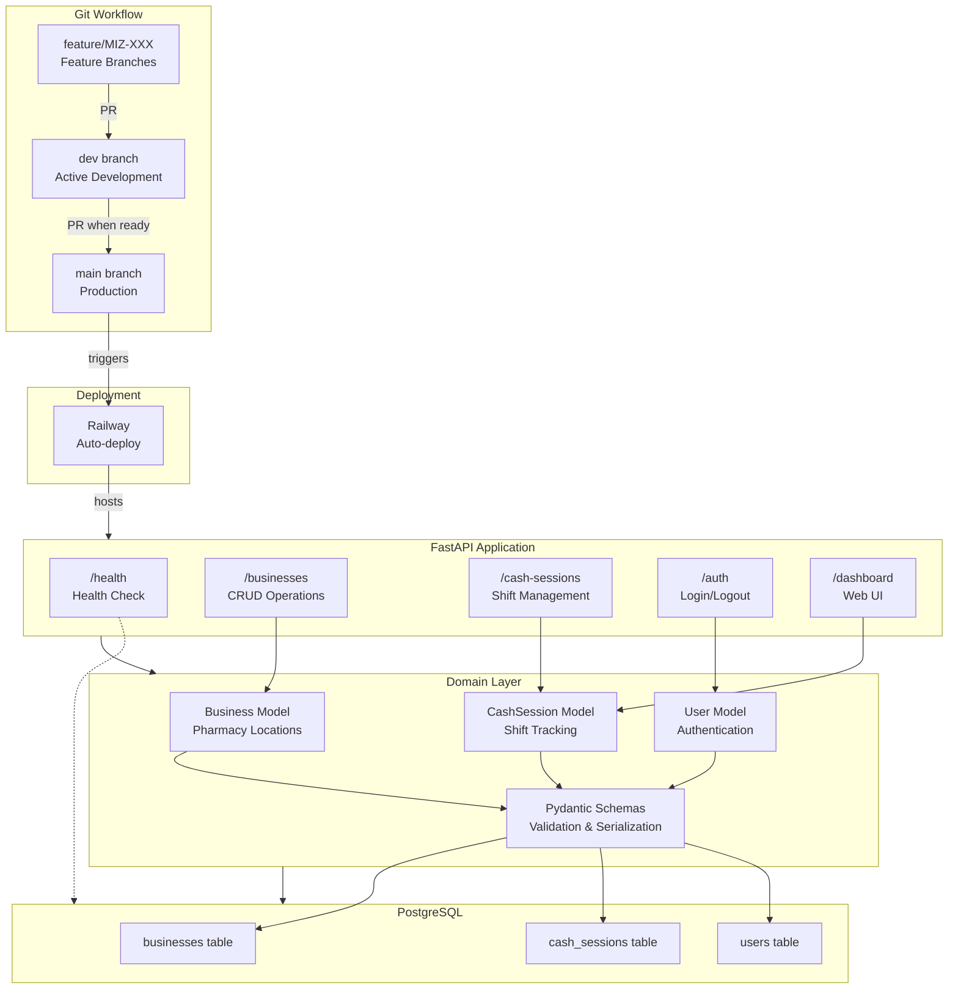

# CashPilot 💰

[](https://github.com/luifer-villalba/cash-pilot/actions)
[](https://www.python.org/downloads/)
[](LICENSE)

A modern, Docker-first backend for pharmacy cash register reconciliation. Built with Python best practices for clean architecture and maintainability.

**Live Demo:** https://cash-pilot-production.up.railway.app/

## 🎯 What It Does

Track daily cash sessions, auto-detect shortages/surpluses, and manage multiple pharmacy locations with full audit trails.

## 🏗️ Architecture


**Stack:** FastAPI • SQLAlchemy async • PostgreSQL • Alembic • pytest • Docker • Railway • GitHub Actions

## 🚀 Quick Start

**Prerequisites:** Docker + Docker Compose
```bash
git clone https://github.com/luifer-villalba/cash-pilot.git
cd cash-pilot
cp .env.example .env
docker compose build
make migrate-upgrade
make hook-install
make run
```

**Access:**
- Dashboard: http://localhost:8000
- API Docs: http://localhost:8000/docs
- Admin Panel: http://localhost:8000/admin

## 🌿 Git Workflow

**Branches:**
- `main` → Production (auto-deploys to Railway)
- `dev` → Active development
- `feature/MIZ-XXX` → Feature branches from `dev`

**Flow:**
```bash
git checkout -b feature/MIZ-123 dev
# work → test → commit
git push -u origin feature/MIZ-123
# PR to dev → review → merge
# When ready: PR dev → main
```

**PR Requirements:** Tests pass • Code formatted • Linting passes • Pre-commit hook installed

## 🛠️ Commands

| Command | Description |
|---------|-------------|
| `make run` | Start FastAPI server |
| `make test` | Run pytest suite |
| `make fmt` | Auto-format (black, ruff, isort) |
| `make lint` | Check code quality |
| `make migrate-upgrade` | Apply DB migrations |
| `make seed` | Load demo data |
| `make sh` | Shell into container |

## 💰 Key Feature: Auto-Reconciliation

CashSession calculates:
- **cash_sales** = `(final_cash - initial_cash) + envelope_amount`
- **total_sales** = `cash_sales + credit_card + debit_card + bank_transfer`
- **difference** = `total_sales - cash_sales`
  - `0` = Perfect match ✅
  - `> 0` = Shortage ⚠️
  - `< 0` = Overage 📦

## 📁 Structure
```
cashpilot/
├── src/cashpilot/
│   ├── api/              # FastAPI endpoints
│   ├── models/           # SQLAlchemy models + Pydantic schemas
│   ├── core/             # DB, config, errors, logging
│   ├── middleware/       # Request ID injection
│   └── scripts/          # seed.py, createuser.py
├── tests/                # pytest suite (54+ tests)
├── alembic/              # Database migrations
├── templates/            # Jinja2 HTML
├── static/               # CSS, JS
└── translations/         # i18n (Spanish/English)
```

## 🌱 Demo Data
```bash
make seed  # Creates 3 pharmacies + 87 cash sessions
```

## 🧪 Testing
```bash
make test  # Run all tests
docker compose run --rm app pytest tests/test_business.py -v
```

## 📊 Database

**Tables:** businesses, cash_sessions, users  
**Relations:** Business → Many CashSessions  
**Migrations:** Alembic version-controlled schema changes

See [API_DEMO.md](API_DEMO.md) for complete API examples.

## ⚠️ Troubleshooting
```bash
make rebuild        # Full rebuild
make fix-perms      # Fix file permissions
make migrate-current # Check migration status
```

## 👤 Author

**Luis F. Villalba** - Backend Developer  
[LinkedIn](https://linkedin.com/in/luis-fernando-villalba) | [GitHub](https://github.com/luifer-villalba)

---

*Portfolio project demonstrating production-ready FastAPI development with async patterns, comprehensive testing, and CI/CD.*