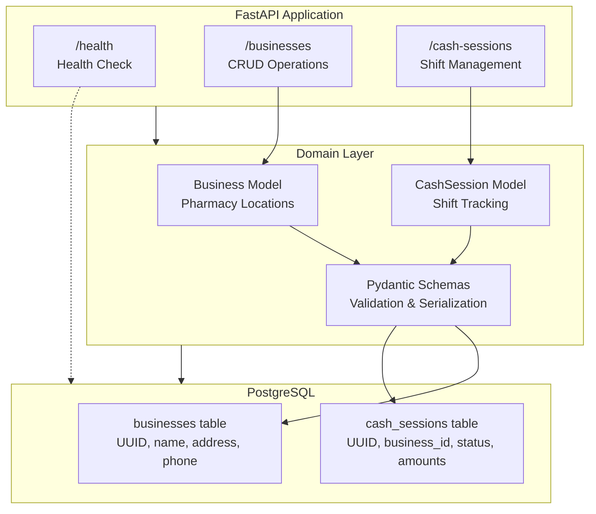

# CashPilot 💰

[](https://github.com/luifer-villalba/cash-pilot/actions)
[](https://www.python.org/downloads/)
[](LICENSE)

A modern, Docker-first backend for pharmacy cash register reconciliation. Built with Python best practices for clean architecture and maintainability.

## 🎯 Project Purpose

CashPilot is a pharmacy cash register reconciliation system designed to:
- Track daily cash sessions (shifts) per pharmacy location
- Auto-calculate cash sales and detect shortages
- Manage multiple pharmacy locations (businesses)
- Provide audit trail for cash handling

Built with production-ready FastAPI patterns and clean architecture principles.

## 🏗️ Architecture



**Layer responsibilities:**
- **API**: HTTP endpoints, dependency injection, error handling
- **Models**: SQLAlchemy ORM + Pydantic schemas, business logic
- **Database**: PostgreSQL with async driver (asyncpg)

## 🚀 Quickstart

### Prerequisites
- Docker & Docker Compose installed
- No local Python required

### Environment Setup

1. **Copy environment template**
```bash
cp .env.example .env
```

2. **Review and customize** `.env` if needed (defaults work for local dev)

3. **Build and start services**
```bash
docker compose build
docker compose up -d
```

### Development Setup

1. **Clone and build**
```bash
git clone https://github.com/luifer-villalba/cash-pilot.git
cd cash-pilot
docker compose build
```

2. **Run migrations**
```bash
make migrate-upgrade
```

3. **Install git hooks** (blocks commits if linting fails)
```bash
make hook-install
```

4. **Start the server**
```bash
make run
```

The API will be available at [http://localhost:8000](http://localhost:8000)

## 🛠️ Available Commands

| Command | Description |
|---------|-------------|
| `make run` | Start the FastAPI server on port 8000 |
| `make test` | Run the test suite with pytest |
| `make fmt` | Auto-format code (ruff + black + isort) |
| `make lint` | Check code quality (runs in pre-commit hook) |
| `make sh` | Open shell inside Docker container |
| `make hook-install` | Install git pre-commit hook |
| `make migrate-create` | Create a new database migration |
| `make migrate-upgrade` | Apply pending migrations |
| `make migrate-current` | Show current migration version |
| `make check-db` | Inspect database tables and version |

## 📁 Project Structure
```
cashpilot/
├── src/
│   └── cashpilot/          # Main application package
│       ├── api/            # API endpoints
│       │   ├── health.py   # Health check endpoint
│       │   ├── business.py # Business CRUD operations
│       │   └── cash_session.py # Cash session management
│       ├── models/         # Database models and schemas
│       │   ├── business.py # Pharmacy location model
│       │   ├── cash_session.py # Cash session model
│       │   ├── business_schemas.py # Business Pydantic schemas
│       │   ├── cash_session_schemas.py # Session Pydantic schemas
│       │   └── enums.py    # Domain enums (SessionStatus)
│       ├── core/           # Core utilities
│       │   ├── db.py       # Database config & session management
│       │   ├── errors.py   # Custom exceptions
│       │   └── logging.py  # Structured logging
│       ├── middleware/     # Request/response middleware
│       │   └── logging.py  # Request ID injection
│       ├── scripts/        # Utility scripts
│       │   └── seed.py     # Demo data seeding
│       ├── admin.py        # SQLAdmin configuration
│       └── main.py         # FastAPI application factory
├── tests/                  # Test suite
│   ├── conftest.py         # Pytest fixtures
│   ├── test_health.py      # Health endpoint tests
│   ├── test_business.py    # Business CRUD tests
│   ├── test_cash_session.py # Cash session tests
│   ├── test_logging_and_errors.py # Error handling tests
│   └── test_reconciliation_properties.py # Reconciliation tests
├── alembic/                # Database migrations
├── .githooks/              # Git hooks (pre-commit)
├── Dockerfile              # Container definition
├── docker-compose.yml      # Service orchestration (app + db)
├── Makefile                # Development commands
├── pyproject.toml          # Python dependencies & tool configs
├── API_DEMO.md             # Complete API walkthrough with cURL
└── README.md               # This file
```

## 🌐 API Documentation

### Running the Server

Start the FastAPI server with:
```bash
make run
```

The server runs on [http://localhost:8000](http://localhost:8000)

### Interactive API Documentation

Once the server is running, access the auto-generated API documentation:

- **Swagger UI**: [http://localhost:8000/docs](http://localhost:8000/docs)
- **ReDoc**: [http://localhost:8000/redoc](http://localhost:8000/redoc)

### Admin Dashboard

Manage businesses and cash sessions via web interface:

- **URL**: [http://localhost:8000/admin](http://localhost:8000/admin)
- Features: Create, edit, filter, and soft-delete records
- Search by name, filter by status/date, view full reconciliation details
- Spanish UI labels for pharmacy staff

### Full API Walkthrough

For detailed cURL examples and complete workflow demos, see [API_DEMO.md](API_DEMO.md)

### Core Endpoints

#### Health Check
```bash
curl http://localhost:8000/health
```

**Response:**
```json
{
  "status": "ok",
  "uptime_seconds": 120,
  "checks": {
    "database": {
      "status": "ok",
      "response_time_ms": 5
    }
  }
}
```

#### Businesses (Pharmacy Locations)

**Create a business:**
```bash
curl -X POST http://localhost:8000/businesses \
  -H "Content-Type: application/json" \
  -d '{
    "name": "Farmacia Central",
    "address": "Av. España 123",
    "phone": "+595981234567"
  }'
```

**Get a business:**
```bash
curl http://localhost:8000/businesses/{business_id}
```

**Update a business:**
```bash
curl -X PUT http://localhost:8000/businesses/{business_id} \
  -H "Content-Type: application/json" \
  -d '{"is_active": false}'
```

#### Cash Sessions (Shifts)

**List sessions (optional filtering):**
```bash
curl "http://localhost:8000/cash-sessions?business_id={business_id}&skip=0&limit=50"
```

**Open a new session:**
```bash
curl -X POST http://localhost:8000/cash-sessions \
  -H "Content-Type: application/json" \
  -d '{
    "business_id": "uuid-here",
    "cashier_name": "María López",
    "initial_cash": 500000.00,
    "shift_hours": "08:00-16:00"
  }'
```

**Get session details:**
```bash
curl http://localhost:8000/cash-sessions/{session_id}
```

**Close a session:**
```bash
curl -X PUT http://localhost:8000/cash-sessions/{session_id} \
  -H "Content-Type: application/json" \
  -d '{
    "final_cash": 1250000.00,
    "envelope_amount": 300000.00,
    "closing_ticket": "T-12345",
    "notes": "Normal shift, no issues"
  }'
```

## 💰 Reconciliation Calculation (Key Feature)

CashSession automatically calculates three critical properties for cash reconciliation:

**cash_sales** = (final_cash - initial_cash) + envelope_amount
- Represents total cash that should be in drawer at end of shift
- Example: `(1,200,000 - 500,000) + 300,000 = 1,000,000₲`

**total_sales** = cash_sales + credit_card + debit_card + bank_transfer
- Total revenue across all payment methods
- Example: `1,000,000 + 800,000 + 450,000 + 150,000 = 2,400,000₲`

**difference** = total_sales - cash_sales
- Reconciliation indicator:
  - `0` = Perfect match ✅ (ideal state)
  - `> 0` = Shortage ⚠️ (missing cash, investigate)
  - `< 0` = Overage 📦 (extra cash in drawer)

Example perfect scenario:
```json
{
  "initial_cash": 500000,
  "final_cash": 1200000,
  "envelope_amount": 300000,
  "credit_card_total": 800000,
  "cash_sales": 1000000,
  "total_sales": 1800000,
  "difference": 800000
}
```

## 🔒 Error Handling & Logging

**Custom Error Responses**

All errors return standardized JSON with:
- `code`: Machine-readable error code (NOT_FOUND, CONFLICT, INVALID_STATE, etc.)
- `message`: Human-readable description
- `details`: Additional context (resource type, IDs, etc.)

Example error response:
```json
{
  "code": "NOT_FOUND",
  "message": "Business with ID 123 not found",
  "details": {"resource": "Business", "resource_id": "123"}
}
```

**Structured Logging**

Every request is logged with:
- Unique request ID (X-Request-ID header)
- HTTP method, path, status code
- Response time
- Structured JSON output for parsing

Request ID is automatically injected into all logs for tracing.

## 📊 Database

The project uses PostgreSQL with SQLAlchemy ORM (async) and Alembic for migrations.

### Current Schema

**businesses**
- `id` (UUID, PK)
- `name` (String, indexed)
- `address` (String, optional)
- `phone` (String, optional)
- `is_active` (Boolean, indexed, default: true)
- `created_at` (DateTime)
- `updated_at` (DateTime)

**cash_sessions**
- `id` (UUID, PK)
- `business_id` (UUID, FK → businesses.id, indexed)
- `status` (String, indexed) - "OPEN" or "CLOSED"
- `cashier_name` (String)
- `shift_hours` (String, optional)
- `opened_at` (DateTime)
- `closed_at` (DateTime, optional)
- `initial_cash` (Numeric 12,2)
- `final_cash` (Numeric 12,2, optional)
- `envelope_amount` (Numeric 12,2, default: 0.00)
- `credit_card_total` (Numeric 12,2, default: 0.00)
- `debit_card_total` (Numeric 12,2, default: 0.00)
- `bank_transfer_total` (Numeric 12,2, default: 0.00)
- `closing_ticket` (String, optional)
- `notes` (String, optional)

**Calculated properties** (CashSession model):
- `cash_sales` = `(final_cash + envelope_amount) - initial_cash`

### Relationships
- One Business → Many CashSessions
- CashSession belongs to one Business

## 🌱 Seeding Demo Data

The project includes a seed script to populate the database with realistic demo data for testing and development.

### What Gets Created

- **3 Pharmacy Businesses**: Farmacia Central, Farmacia San Lorenzo, Farmacia Villa Morra
- **30 Days of Cash Sessions**: Varied shift patterns (morning/afternoon)
- **Realistic Reconciliation Scenarios**:
  - 60% perfect matches (difference = 0)
  - 25% small shortages (₲50k-200k)
  - 10% small surpluses (₲10k-100k)
  - 5% significant shortages (>₲200k)

### Usage

```bash
# Seed demo data (idempotent - safe to run multiple times)
make seed

# Reset database and re-seed (destructive!)
make seed-reset
```

The seed script is **idempotent** - it checks if data exists before creating, so you can safely run `make seed` multiple times without duplicating data.

### Manual Execution

You can also run the seed script directly:

```bash
docker compose exec app python -m cashpilot.scripts.seed
```

### Sample Output

```
🌱 Starting CashPilot seed script...

✅ Created 3 businesses
✅ Created 87 cash sessions

🎉 Seed complete!
   📊 Businesses: 3
   📊 Cash sessions: 87

   📈 Reconciliation outcomes:
      ✓ Perfect matches: 52
      ⚠ Shortages: 22
      📦 Surpluses: 9
```

## 🔄 Development Workflow

1. Make changes in `src/`
2. Run `make fmt` to auto-format
3. Run `make test` to verify tests pass
4. Commit → pre-commit hook runs `make lint` automatically
5. If lint fails, fix issues and commit again

## 🧪 Testing

The project uses pytest with FastAPI TestClient:

```bash
# Run all tests
make test

# Run tests in the container shell (for debugging)
make sh
pytest -v
```

## 🏗️ Architecture Patterns

**Application Factory**: `create_app()` returns fresh FastAPI instance for clean test isolation

**Async SQLAlchemy**: All database operations use async/await with AsyncSession

**Dependency Injection**: Database sessions injected via `Depends(get_db)`

**Pydantic Schemas**: Separate schemas for Create/Read/Update operations

**Alembic Migrations**: Version-controlled database schema changes

**Code Quality**: Pre-commit hooks enforce ruff, black, isort standards

## 📚 Next Steps

### Sprint 3: Production Ready
- [ ] Add comprehensive tests for Business + CashSession endpoints
- [ ] Add seed script with sample data
- [ ] Set up GitHub Actions CI/CD
- [ ] Deploy to Render/Railway with PostgreSQL
- [ ] Add architecture diagram to README

### Future Enhancements
- [ ] Add authentication and authorization (JWT)
- [ ] Implement filtering and pagination for list endpoints
- [ ] Add Movement model for detailed cash flow tracking
- [ ] Add Category model for expense/income categorization
- [ ] Implement daily/weekly/monthly reports
- [ ] Add API rate limiting
- [ ] Add monitoring (Datadog/Sentry integration)

## ⚠️ Troubleshooting

### Port 8000 already in use
```bash
lsof -i :8000
kill -9 <PID>
```

### Database connection issues
```bash
# Full rebuild and restart
make rebuild

# Or quick restart
make down && make up
```

### File permission errors
```bash
make fix-perms
```

### Stale code/cache issues
```bash
# Reload app manually
make reload

# Or use watch mode
make dev-watch
```

### Database won't initialize
```bash
# Check current migration status
make migrate-current

# Create fresh test database
docker compose exec db psql -U cashpilot -d cashpilot_dev -c "\dt"
```

## 👤 Author

**Luis F. Villalba** - Backend Developer  
[LinkedIn](https://linkedin.com/in/luis-fernando-villalba) | [GitHub](https://github.com/luifer-villalba)

---

*This project demonstrates production-ready FastAPI backend development with clean architecture, async patterns, and comprehensive testing.*